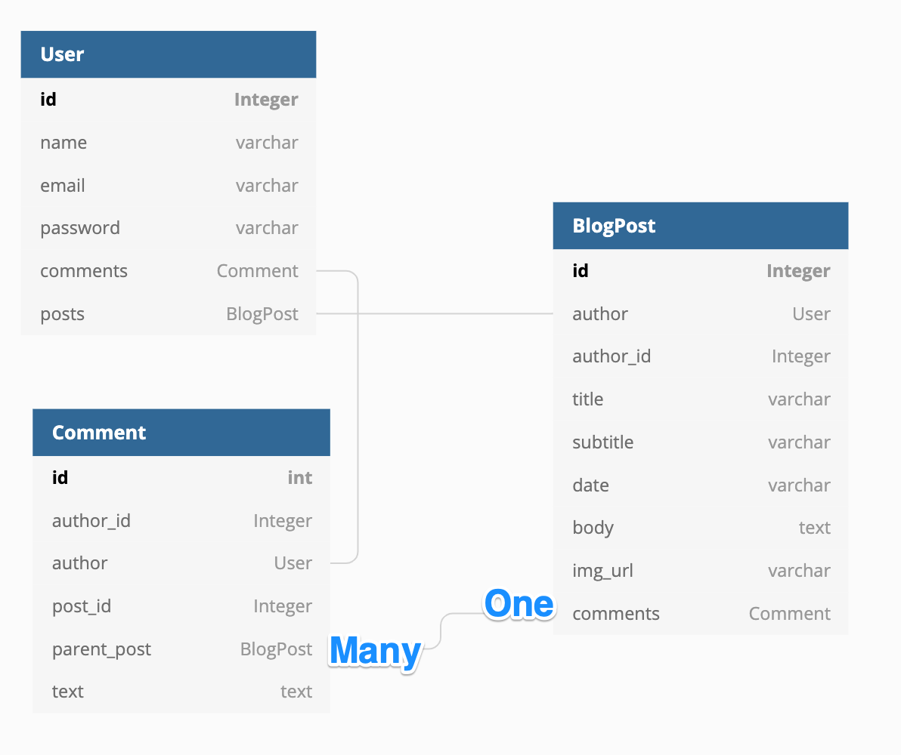
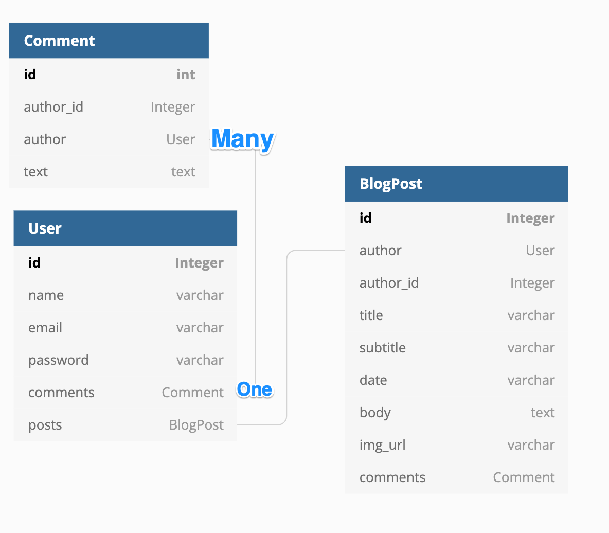

## Flask Blog Website with User's Authentication 
#### This is a Web Development project with user's authentication using Flask, and SQLAlchemy.

#### This project running on : [https://replit.com/@ViktoriusSuwand/AppBrewery-python-Day-69-Blog-Capstone-Part-4](https://replit.com/@ViktoriusSuwand/AppBrewery-python-Day-69-Blog-Capstone-Part-4)

#### Documentation can be found on : [https://github.com/viktoriussuwandi/Flask-Blog-Website-with-User-Authentication](https://github.com/viktoriussuwandi/Flask-Blog-Website-with-User-Authentication)

## Technology and Features :
    * python-flask, and jinja2 template for back end - front end.
    * flask-SQLAlchemy as database modules.
    * wtform as form input and form validation.
    * werkzeug security for password hashing-salting.
    * flask-login as user's login manager and user's authentication.

## Development
1. Establish model data required for application : `Users`, `BlogPosts`, and `Comments`.
   Each table has attributes, and relationship as below :
  

2. User's activities consists of :
   - `Add` new user, `Edit` and `delete` existing user's profile.
   - `Post` new article, Edit and `delete` existing article.
   - `Comment` to an article, and `delete` existing comment.
   - Doing additional activations, such as : `user's activation`, `post's activation`, and `comment's activation`.
        
3. User's authorization divided into user's role, such as : `admin`, and `user`:
   - Only `admin` can do `activation` activities.
   - Only `admin` and `authorized users` can `edit`, and `delete` their own article
   - Only `admin` can `delete` comments.

## Activities

### Register, login, and logout

### Posting article

### Comment to an article

